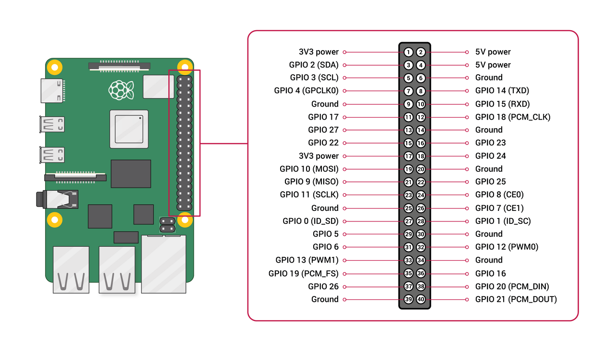

# DALIHub Installer

[](README.ko.md)

Installation script for the DALI lighting control system.

## Quick Install

```bash
curl -sSL https://raw.githubusercontent.com/niot-inc/dalihub-installer/main/install.sh | sudo bash
```

## Requirements

- **Hardware**: Raspberry Pi 4/5 + DALI HAT
- **OS**: Raspberry Pi OS (64-bit recommended), Debian 11+, Ubuntu 22.04+
- **Network**: Internet connection (during installation)

## HAT Installation Order (Important)

The DALI HAT must be installed in the correct order. If the Pi boots with the HAT attached but UART is not yet enabled (e.g., fresh OS install), the HAT's co-processor may enter a bad state (white LED stays solid instead of blinking). This state may not recover with a simple reboot — the HAT must be physically removed and reattached.

### Correct Setup Procedure

1. Boot the Pi **without** the HAT attached
2. Run the installer to configure UART and install DALIHub
3. **Power off** the Pi completely
4. Attach the DALI HAT to the Pi
5. Power on — the white LED should blink, indicating normal operation

### If the HAT is Unresponsive

If the white LED stays solid (not blinking) and serial communication fails:

1. **Power off** the Pi
2. **Remove** the HAT from the Pi
3. Wait a few seconds, then **reattach** the HAT
4. **Power on** the Pi
5. Verify serial communication:
   ```bash
   python3 -c "import serial; s = serial.Serial('/dev/serial0', 19200, timeout=3); s.write(b'v\n'); print(s.readline()); s.close()"
   ```
   - **OK**: `b'V011404\n'` (version response received)
   - **NG**: `b''` (empty response — HAT is not communicating, repeat steps 1-4)

> **Note**: The DALI line can remain connected to the HAT during removal/reattachment. The HAT performs an automatic power detection sequence 6 seconds after boot — this requires the UART pins to be properly initialized.

## Components

| Service | Port | Description |
|---------|------|-------------|
| DALIHub | 3000 | Web UI & REST API |
| Mosquitto | 1883 | MQTT Broker |
| Mosquitto WS | 9001 | MQTT over WebSocket |
| Watchtower | - | Auto Update |

## Installation Options

```bash
# Default installation
sudo bash install.sh

# Skip UART setup (non-Pi environments)
sudo bash install.sh --skip-uart

# Custom installation path
sudo bash install.sh --install-dir /home/pi/dalihub
```

## Access After Installation

- **Web UI**: `http://<raspberry-pi-IP>:3000`
- **MQTT**: `mqtt://<raspberry-pi-IP>:1883`
  - Username: `dalihub`
  - Password: `dalihub`

## Configuration

Install location: `/opt/dalihub`

```
/opt/dalihub/
├── docker-compose.yml    # Docker configuration
├── .env                  # Environment settings
├── config/               # DALIHub settings
├── data/                 # Data storage
├── logs/                 # Logs
└── mosquitto/            # MQTT Broker
    ├── config/
    ├── data/
    └── log/
```

### Environment Variables (.env)

The `.env` file is auto-generated during installation and does not need to be modified manually.

```bash
# Timezone (auto-detected from system)
TZ=Asia/Seoul

# Watchtower API token (auto-generated for security)
WATCHTOWER_TOKEN=<auto-generated>
```

## Auto Update

You can check and apply updates from the DALIHub web console (`Settings > System Update`).

- Watchtower's periodic automatic polling is disabled
- You can trigger updates at any time from the web console

### Manual Update (CLI)

If the web console is unavailable:
```bash
cd /opt/dalihub
docker compose pull dalihub
docker compose up -d
```

## Management Commands

```bash
cd /opt/dalihub

# Check status
docker compose ps

# View logs
docker compose logs -f
docker compose logs -f dalihub      # DALIHub only
docker compose logs -f mosquitto    # MQTT only

# Restart
docker compose restart

# Stop
docker compose down

# Start
docker compose up -d
```

## Remote Access (Tailscale)

You can install Tailscale on customer devices for remote access.

### Install Tailscale

```bash
curl -sSL https://raw.githubusercontent.com/niot-inc/dalihub-installer/main/tailscale-install.sh | sudo bash -s -- --auth-key 'tskey-auth-xxxxx'
```

- Get an auth key from the [Tailscale Admin Console](https://login.tailscale.com/admin/settings/keys)
- The device will automatically join the network with the `tag:dalihub` tag
- The `--tags` option can be used to specify custom ACL tags

### Uninstall Tailscale

```bash
curl -sSL https://raw.githubusercontent.com/niot-inc/dalihub-installer/main/tailscale-uninstall.sh | sudo bash
```

## Uninstall

```bash
curl -sSL https://raw.githubusercontent.com/niot-inc/dalihub-installer/main/uninstall.sh | sudo bash
```

Or:
```bash
sudo bash /opt/dalihub/uninstall.sh
```

## Troubleshooting

### Serial Port Not Connected

1. Check UART settings:
   ```bash
   ls -la /dev/serial0
   ```

2. A reboot may be required:
   ```bash
   sudo reboot
   ```

### UART Loopback Test

You can verify UART is working correctly by connecting GPIO 14 (TX) and GPIO 15 (RX) together with a jumper wire, then running a loopback test.



1. **Power off** the Pi and connect GPIO 14 (TX) to GPIO 15 (RX) with a jumper wire
2. Power on and run the test:
   ```bash
   python3 -c "
   import serial
   s = serial.Serial('/dev/serial0', 19200, timeout=2)
   print('Port opened:', s.name)
   s.write(b'hello')
   data = s.read(5)
   print('Received:', data)
   s.close()
   "
   ```
   - **OK**: `Received: b'hello'` (data looped back successfully)
   - **NG**: `Received: b''` (UART is not configured correctly, check `enable_uart=1` in config.txt)

3. **Remove the jumper wire** before attaching the DALI HAT

### DALI Lighting Test

Stop DALIHub first to free the serial port, then test directly:

```bash
docker stop dalihub
```

**All lights OFF** (broadcast):
```bash
python3 -c "
import serial, time
s = serial.Serial('/dev/serial0', 19200, timeout=3)
s.write(b'hFE00\n')
time.sleep(0.5)
while True:
    line = s.readline()
    if not line: break
    print('RX:', line)
s.close()
"
```

**All lights ON** (broadcast):
```bash
python3 -c "
import serial, time
s = serial.Serial('/dev/serial0', 19200, timeout=3)
s.write(b'hFEFE\n')
time.sleep(0.5)
while True:
    line = s.readline()
    if not line: break
    print('RX:', line)
s.close()
"
```

Start DALIHub again after testing:
```bash
docker start dalihub
```

### MQTT Connection Failed

1. Check Mosquitto status:
   ```bash
   docker compose logs mosquitto
   ```

2. Verify credentials (`.env` file)

### Container Won't Start

1. Check Docker status:
   ```bash
   sudo systemctl status docker
   ```

2. Check logs:
   ```bash
   docker compose logs
   ```

## Support

- Issues: [GitHub Issues](https://github.com/niot-inc/dalihub-installer/issues)
